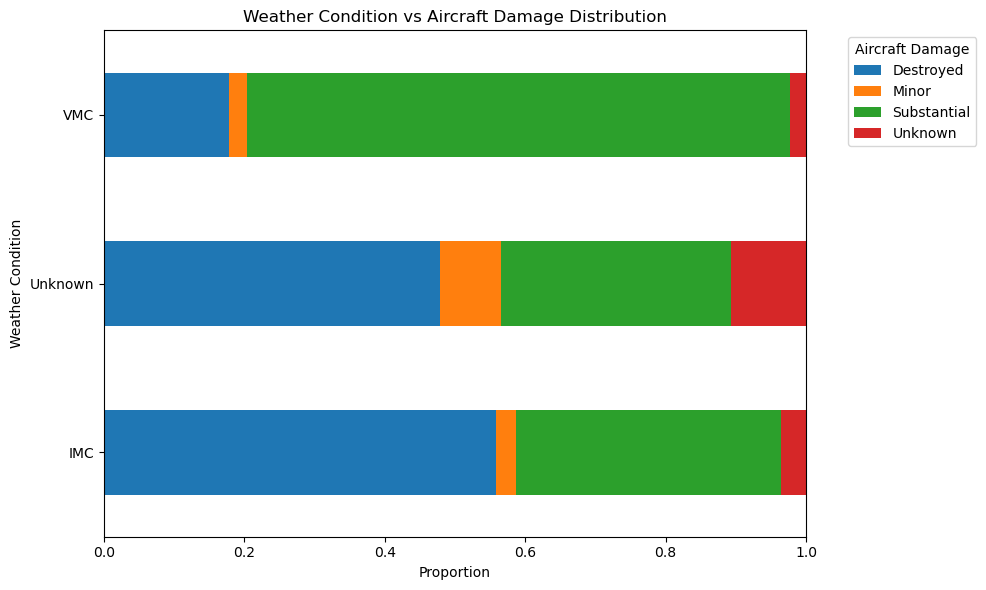
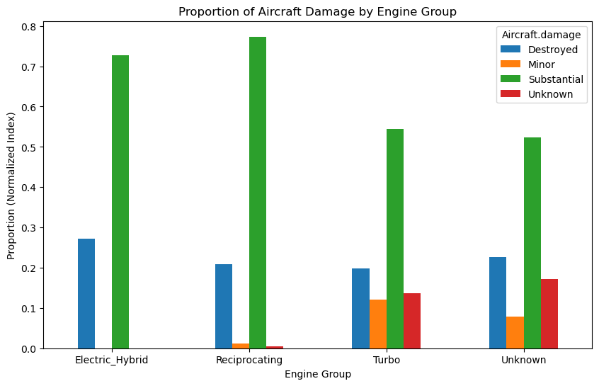
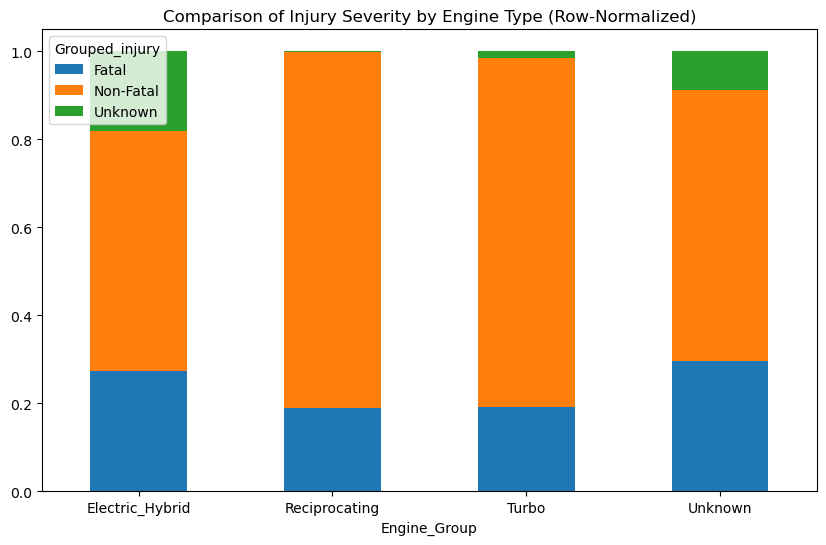

# Phase-1-project
Aviation accident risk analysis
# **Introduction**

Due to the fast paced changes across industries due to technology advancements ,most companies are working on making sure that they become the best in every competitive business fields. As part of this strategy ,our company is expanding in to new industries to diversify its portfolio including the aviation industry by providing both commercial and private aircraft services. Venturing into this type of industry might be a bit challenging due to some of the risk factors invovled and limited  knowledge on the best aircrafts models  to purchase based on their safety level and lower accident risks.

This project focuses to analyze aviation accident data to provide clear and accurate findings for decision making in regards to the purchase of the aircrafts.Using data analysis tecniques,we will be able to identify the trends and patterns of the accident risks and use our findings to help decide which aircraft to purchase.
# **1.Business Understanding**

Stakeholders

1.Head of Aviation Division:The primary decision maker to determine aircrafts to purchase

2.Shareholders:Assess risk before investment, inform strategic decisions, protect financial interests, and monitor safety performance.

3.Rgulatory body:Use findings to identify high-risk aircraft, inform safety policies, and focus oversight on areas with higher risk.

4.Suppliers:Identify high-risk models, improve product design, support safety communication, and align with operators needs.

5.Operations Team:Use our findings to enforcing regulations, safety oversight and training.

# Business Value

This analysis provide a number of benefits to our company which include:

1.Future Accident prevention by understanding factors contributing to the accidents and their root causes.

2.Cost savings which include preventing loss of life,aircraft damages,and operations disruptions.

3.Regulatory compliance by adhering to standards set by bodies and ensuring legal compliance and helps organizations meet established safety requirements.

4.Continuous Improvement through Risk analysis which mandates continuous monitoring and review of safety performance to adapt to new challenges and emerging risks.

5.Data-Driven Decision Making as the process yields evidence-based insights that enable aviation professionals and regulators to make informed decisions regarding safety improvements and resource allocation.
 **Data Understanding**

In this analysis we will use data from the National Transportation Safety Board that includes aviation accident data from 1962 to 2023 about civil aviation accidents and selected incidents in the United States and international waters.From this analysis we will use statistical analysis to summarize, explore, and visualize patterns in the data.
# Data Exploration
In this section we will get to have a summary of our dataset,the number of rows and columns,a glimpse of the entries to understand what we are working with and what we need to make our analysis.
From the above we have a summary of dataset :

1. The dataset has 88,889 rows and 31 columns.
2. We have 5 numerical columns and 26 categorical columns.
3. Most accidents report zero fatalities and injuries based on the median values of 0 across injury columns.
4. The majority of aircraft involved in accidents are single-engine aircraft, as indicated by a median of 1 engine.
Data Cleaning
In this part we will check fo missing values,duplicates and outliers and select the columns that are relevant to our analysis.
# Cleaning the Event date 
In this section we will extract the event year 
## Cleaning Weather Conditions
The Weather.Condition variable has labels such as 'UNK','Unk' and Nan(missing values) 
These categories are standardized into label'Unknown'
Cleaning Injury Severity
In this section we will categorize the injury severity into two which are 'fatal and 'non_fatal' to simplify the column for more clarity and easy understsnding on the level of severity of injuries.
From the above step we can conclude that the reported number of Non fatal injuries(70063) are more as compared to reported fatal injuries(17826) in the aircraft accidents.
Clean Aircraft specific data
Group Engine Types
In this section we will classify the engine types into categories based on their unique shared properties to allow meaningful comparisons across the aircraft categories.We will use the most common engine types that appear in our dataset for comparisons.
**Classify the engine types into four main categories based on the shared properties; 1.Reciprocating,2.Turbo for all with 'Turbo properties'3.Electric_Hybrid 4.Uknown for UNK Unknown,NONE,LR.**
# Clean Purpose of flight
Group the make column into main categories
Comparison for Engine type and injury severity
From the comparison above we can observe Reciprocating engine group had the lowest percentage of fatal injuries with approximately 18.9% and a high proportion of non fatal at 81.0%.
Overally the table suggests that reciprocating and turbo engine have a higher proportion of non fatal injuries compared to electric and others while unkown has the highest number of fatal engine.The safest engine are Reciprocating and Turbo 
Crosstab for Engine type vs Aircraft damage
Visual Representation of the Engine and Aircraft damage comparison
Electric and Unknown have the highest percentage of destroyed aircraft with 27.2% and 22% respectively while reciprocating and turbo have the lowest percentage of destroyed.From the above information Reciprocating and turbo are most likely to be less costly since they have the lowest percentage of destroyed and highest percentage of minor damages.
Crosstab comparison of Weather vs Aircraft damage
Under VMC a large majority of incidents (approximately 77.3%) resulted in Substantial damage.
Under IMC Instrument Meteorological Conditions, the highest percentage of incidents (approximately 55.9%) resulted in the aircraft being Destroyed.This suggests that while substantial damage is common in VMC incidents, the more severe outcome of aircraft destruction is significantly more probable in IMC incidents, highlighting the risks associated with poor weather conditions.
Visual Presentation of Weather vs Aircradt damage
ecutive Summary & Business Recommendations

This analysis examined aviation accident outcomes across weather conditions and engine types to support data-driven decision-making as the company enters the aviation industry. By aggregating injury severity, aircraft damage, and engine categories, clear safety and cost-risk patterns emerged.
# Key Findings

**Weather impact:**
Under VMC (Visual Meteorological Conditions), approximately 77.3% of incidents resulted in Substantial damage, but aircraft destruction was less common.
Under IMC (Instrument Meteorological Conditions), approximately 55.9% of incidents resulted in Destroyed aircraft, indicating significantly higher severity during poor weather conditions.

**Engine type impact:**
Electric and Unknown engine types showed the highest percentage of destroyed aircraft (≈27.2% and ≈22% respectively).
Reciprocating and Turbo engines had the lowest percentage of destroyed aircraft and the highest proportion of minor or non-fatal outcomes.
Reciprocating engines had the lowest fatal injury rate (≈18.9%) and a high non-fatal rate (≈81.0%), indicating stronger survivability.
 Business Recommendations
1.**Prioritize Reciprocating and Turbo Engine Aircraft for Initial Fleet Acquisition**
Based on both damage severity and injury outcomes, aircraft with reciprocating and turbo engines consistently demonstrate:
Lower likelihood of total aircraft destruction
Higher proportion of non-fatal injuries
Reduced financial exposure from catastrophic losses

**Business Value:**
These engine types offer the best balance between safety, operational reliability, and cost control, making them ideal for entry into the aviation market.

2.**Limit Operations in IMC Conditions or Invest in Advanced Pilot Training & Instrumentation**
IMC conditions show a significantly higher probability of aircraft destruction and severe outcomes compared to VMC.

# Actionable Strategies:
Restrict IMC operations during early business phases

**Invest in:**
Advanced pilot instrument training
Enhanced weather detection and navigation systems

**Business Value:**
Reducing IMC exposure lowers the risk of high-cost incidents and improves safety performance metrics, which are critical for regulatory approval and insurance negotiations.

3.**Avoid or Closely Evaluate Electric and Unknown Engine Types in Early Expansion**
Electric and unknown engine categories show disproportionately higher destruction and fatality rates, likely due to:
Limited historical data
Emerging or inconsistent technology
Maintenance and reliability uncertainties
# Business Value:
Focusing on proven engine technologies minimizes operational uncertainty and protects capital investment during the company’s early growth phase.

# Strategic Conclusion
By cleaning, aggregating, and visualizing aviation accident data, this analysis provides actionable insights that directly inform fleet selection, operational planning, and risk mitigation strategies. The findings strongly support a conservative, safety-first approach that prioritizes proven engine technologies and favorable operating conditions as the organization enters the aviation sector.
## 📊 Interactive Dashboard (Tableau)

An interactive Tableau dashboard was created to explore aviation accident risk
by weather condition, engine type, aircraft damage, and injury severity.

🔗 **View the live dashboard here:**  
https://public.tableau.com/app/profile/marian.amondi/viz/AviationRiskanalysis/Aviation?publish=yes
